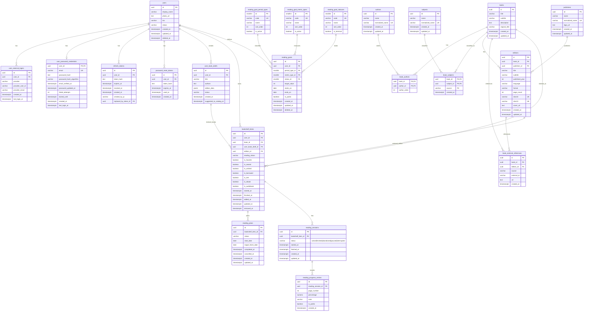

# Database Schema MVP ER

Status: Aprovado

```mermaid
erDiagram
    users ||--o{ user_external_logins : has
    users ||--o| user_password_credentials : has
    users ||--o{ refresh_tokens : has
    users ||--o{ password_reset_tokens : has
    users ||--o{ user_book_drafts : creates
    users ||--o{ bookshelf_items : owns
    users ||--o{ reading_goals : defines

    authors ||--o{ book_authors : writes
    books ||--o{ book_authors : has
    books ||--o{ book_subjects : classified_as
    subjects ||--o{ book_subjects : classifies
    books ||--o{ editions : has
    publishers ||--o{ editions : publishes

    books ||--o{ book_external_references : references
    editions ||--o{ book_external_references : references

    books ||--o{ bookshelf_items : shelved_as
    editions ||--o{ bookshelf_items : selected_edition
    user_book_drafts ||--o{ bookshelf_items : shelved_locally

    bookshelf_items ||--o{ reading_plans : plans
    bookshelf_items ||--o{ reading_sessions : has
    reading_sessions ||--o{ reading_progress_entries : records

    reading_goal_period_types ||--o{ reading_goals : classifies
    reading_goal_metric_types ||--o{ reading_goals : measures
    reading_goal_statuses ||--o{ reading_goals : states

    users {
        uuid id PK
        varchar display_name
        text photo_url
        varchar bio
        varchar status
        timestamptz created_at
        timestamptz updated_at
        timestamptz deleted_at
    }

    user_external_logins {
        uuid id PK
        uuid user_id FK
        varchar provider
        varchar provider_user_id
        varchar provider_email
        timestamptz created_at
        timestamptz last_login_at
    }

    user_password_credentials {
        uuid user_id PK,FK
        varchar email UK
        text password_hash
        varchar password_hash_algorithm
        timestamptz email_verified_at
        timestamptz password_updated_at
        int failed_attempts
        timestamptz locked_until
        timestamptz created_at
        timestamptz last_login_at
    }

    refresh_tokens {
        uuid id PK
        uuid user_id FK
        text token_hash
        timestamptz expires_at
        timestamptz revoked_at
        timestamptz created_at
        varchar created_by_ip
        uuid replaced_by_token_id FK
    }

    password_reset_tokens {
        uuid id PK
        uuid user_id FK
        text token_hash
        timestamptz expires_at
        timestamptz used_at
        timestamptz created_at
    }

    books {
        uuid id PK
        varchar title
        varchar subtitle
        text description
        varchar original_title
        timestamptz created_at
        timestamptz updated_at
    }

    authors {
        uuid id PK
        varchar name
        varchar normalized_name UK
        timestamptz created_at
        timestamptz updated_at
    }

    book_authors {
        uuid book_id PK,FK
        uuid author_id PK,FK
        int author_order
    }

    subjects {
        uuid id PK
        varchar name
        varchar normalized_name UK
        timestamptz created_at
        timestamptz updated_at
    }

    book_subjects {
        uuid book_id PK,FK
        uuid subject_id PK,FK
        varchar source PK
        timestamptz created_at
    }

    publishers {
        uuid id PK
        varchar name
        varchar normalized_name UK
        text logo_url
        timestamptz created_at
        timestamptz updated_at
    }

    editions {
        uuid id PK
        uuid book_id FK
        uuid publisher_id FK
        varchar title
        varchar subtitle
        int published_year
        varchar language
        varchar format
        int page_count
        varchar isbn10 UK
        varchar isbn13 UK
        text cover_url
        timestamptz created_at
        timestamptz updated_at
    }

    book_external_references {
        uuid id PK
        uuid book_id FK
        uuid edition_id FK
        varchar source
        varchar external_id
        text url
        timestamptz created_at
    }

    user_book_drafts {
        uuid id PK
        uuid user_id FK
        varchar title
        text authors
        jsonb edition_data
        varchar status
        timestamptz created_at
        timestamptz suggested_to_catalog_at
    }

    bookshelf_items {
        uuid id PK
        uuid user_id FK
        uuid book_id FK
        uuid user_book_draft_id FK
        uuid edition_id FK
        varchar reading_status
        boolean is_favorite
        boolean is_owned
        boolean is_wished
        boolean is_borrowed
        boolean is_lent
        boolean is_ebook
        boolean is_audiobook
        timestamptz started_at
        timestamptz finished_at
        timestamptz added_at
        timestamptz updated_at
        timestamptz removed_at
    }

    reading_plans {
        uuid id PK
        uuid bookshelf_item_id FK
        varchar status
        date start_date
        date target_finish_date
        timestamptz completed_at
        timestamptz cancelled_at
        timestamptz created_at
        timestamptz updated_at
    }

    reading_sessions {
        uuid id PK
        uuid bookshelf_item_id FK
        varchar status "active|finished|abandoned|paused|interrupted"
        timestamptz started_at
        timestamptz finished_at
        timestamptz created_at
        timestamptz updated_at
    }

    reading_progress_entries {
        uuid id PK
        uuid reading_session_id FK
        int page_number
        numeric percentage
        varchar note
        boolean is_public
        timestamptz created_at
    }

    reading_goal_period_types {
        smallint id PK
        varchar code UK
        varchar name
        int sort_order
        boolean is_active
    }

    reading_goal_metric_types {
        smallint id PK
        varchar code UK
        varchar name
        int sort_order
        boolean is_active
    }

    reading_goal_statuses {
        smallint id PK
        varchar code UK
        varchar name
        int sort_order
        boolean is_terminal
    }

    reading_goals {
        uuid id PK
        uuid user_id FK
        smallint period_type_id FK
        smallint metric_type_id FK
        smallint status_id FK
        int target_value
        date starts_on
        date ends_on
        boolean is_public
        timestamptz created_at
        timestamptz updated_at
        timestamptz deleted_at
    }
```
